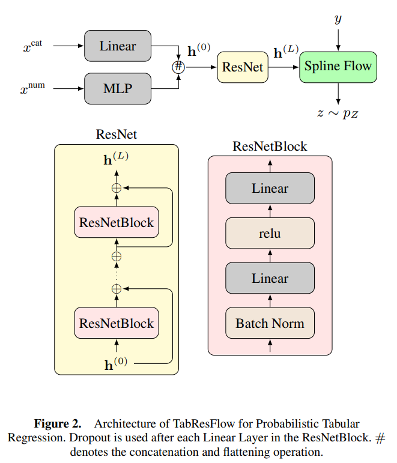

# TabResFlow: A Normalizing Spline Flow Model for Probabilistic Univariate Tabular Regression

[](https://ecai2025.eu/)
[](https://opensource.org/licenses/MIT)
[](https://www.python.org/downloads/)
[](https://arxiv.org/pdf/2508.17056)

> **Official PyTorch Implementation** of the paper accepted at the **European Conference on Artificial Intelligence (ECAI 2025)**.

---

## 📖 Abstract

**TabResFlow** is a novel deep learning framework designed for **probabilistic univariate regression** on tabular data. While tabular data remains a challenge for deep learning, quantifying uncertainty in regression tasks is equally critical.

TabResFlow combines the flexibility of **Rational Quadratic Spline (RQS)** normalizing flows with a specialized **Residual Architecture** adapted for heterogeneous tabular features. Unlike standard regression models that output a single point estimate, TabResFlow learns the full conditional probability density of the target variable, allowing for robust uncertainty estimation and improved log-likelihood performance.

**Key Features:**
* **Probabilistic Output:** Exact likelihood estimation and sampling.
* **Tabular-Specific Architecture:** Embeddings for categorical features and residual blocks for numerical stability.
* **Spline Flows:** High expressivity using Neural Spline Flows.

## 🏗️ Architecture



## 🚀 Installation

### Prerequisites
* Linux or macOS
* Python 3.9+
* PyTorch 2.0+

### Setup
1.  **Clone the repository:**
    ```bash
    git clone [https://github.com/18kiran12/TabResFlow.git](https://github.com/18kiran12/TabResFlow.git)
    cd TabResFlow/src/probabilistic_flow_boosting
    ```
2. **Running the code**
    ```bash
    python run_resflow.py
    ```

### Acknowledgements
* Code and data based on [TreeFlow: Going Beyond Tree-based Parametric Probabilistic Regression](https://github.com/pfilo8/TreeFlow)
* Thanks to developers of [Zuko](https://github.com/probabilists/zuko) library

### Citation
```
@inproceedings{madhusudhanan2025tabresflow,
  title={TabResFlow: A Normalizing Spline Flow Model for Probabilistic Univariate Tabular Regression},
  author={Madhusudhanan, Kiran and Yalavarthi, Vijaya Krishna and Sonntag, Jonas and Stubbemann, Maximilian and Schmidt-Thieme, Lars},
  journal={28th European Conference on Artificial Intelligence (ECAI)},
  year={2025}
}
```
